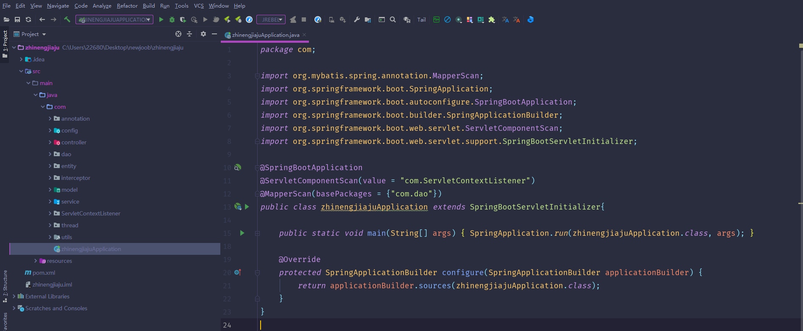
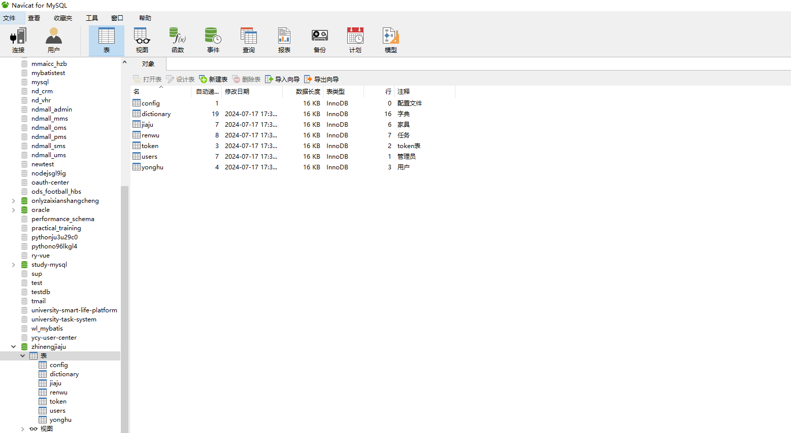
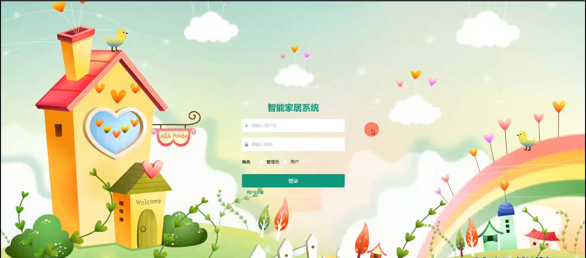
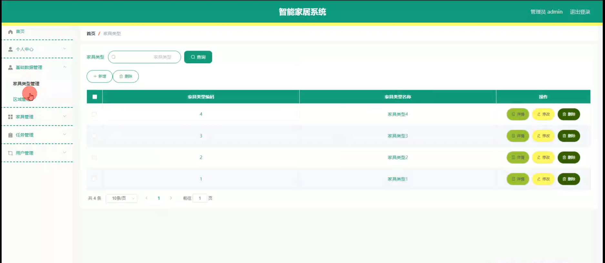
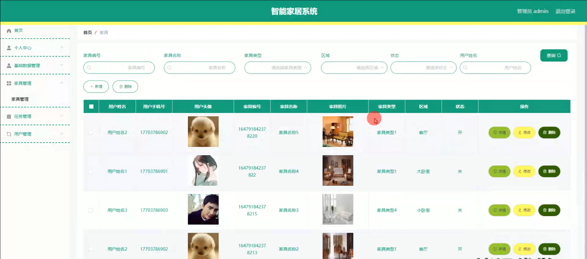
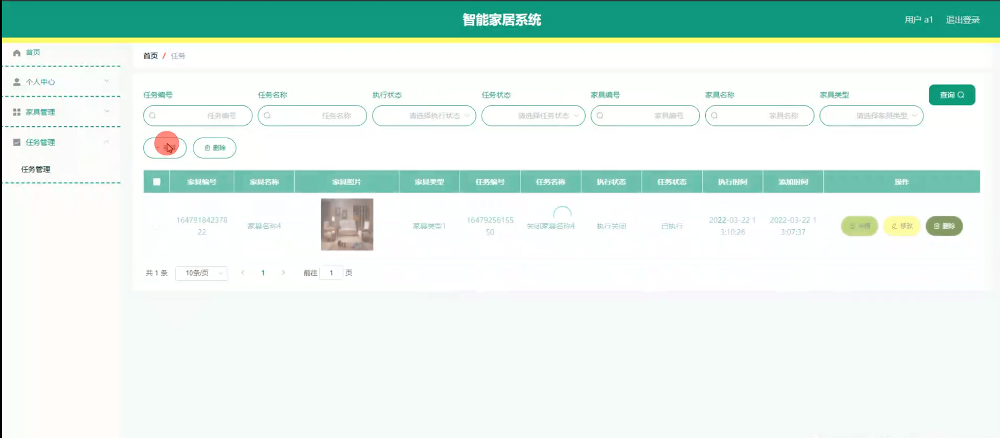
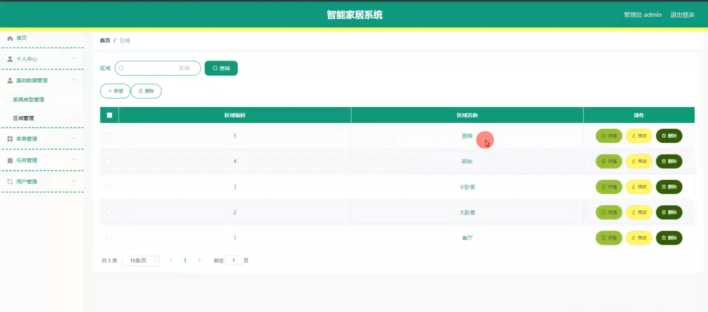

# 基于springboot的智能家居系统

<h4 style='color:red'>联系不到我，就看我的主页 </h4> 
 
#### 介绍

随着物联网（IoT）技术的发展和智能家居市场的不断扩大，越来越多的家庭开始采用智能家居系统来提升生活质量。然而，现有的智能家居系统在管理和用户体验上仍存在一定的不足，如设备兼容性差、操作复杂等问题。基于此背景，我开发了一套基于Spring Boot的智能家居系统，旨在通过统一管理和简化操作，提升用户的智能家居体验。
该系统拥有两种角色：管理员角色和用户角色。管理员角色主要负责系统的整体管理和维护，包括家具类型、区域和用户的管理；用户角色则主要负责日常的家具管理和任务执行。

#### 技术栈

后端技术栈：Springboot+Mysql+Maven

前端技术栈：Vue+Html+Css+Javascript+ElementUI

开发工具：Idea+Vscode+Navicate

#### 系统功能介绍

管理员角色功能模块  
个人中心：  
个人信息管理：管理员可以查看和修改个人信息，包括姓名、联系方式、密码等。  
消息通知：管理员可以接收系统通知和公告，了解系统更新和重要事项。  
基础数据管理：  
家具类型管理：管理员可以添加、修改和删除家具类型，如灯光、空调、摄像头等，以便系统更好地分类和管理不同类型的智能家具。  
区域管理：管理员可以定义和管理家具所在的区域，如客厅、卧室、厨房等，便于用户对家具进行区域化管理。  
家具管理：  
家具添加：管理员可以添加新的智能家具设备，包括设备名称、类型、所属区域等信息。  
家具修改：管理员可以修改已有家具的信息，如更改设备名称、类型或所属区域。  
家具删除：管理员可以删除不再使用或损坏的家具设备，保持系统数据的准确性。  
任务管理：  
任务创建：管理员可以创建新的任务，如定时开关灯、调节空调温度等，提升用户的智能家居体验。  
任务修改：管理员可以修改已有任务的设置，如更改执行时间、任务内容等。  
任务删除：管理员可以删除不再需要的任务，保持任务列表的简洁。  
用户管理：  
用户添加：管理员可以添加新的用户账号，并分配相应的权限。  
用户修改：管理员可以修改已有用户的信息，如更改用户名、密码等。  
用户删除：管理员可以删除不再使用的用户账号，保持系统用户数据的准确性。  

用户角色功能模块  
个人中心：  
个人信息管理：用户可以查看和修改个人信息，包括姓名、联系方式、密码等。  
消息通知：用户可以接收系统通知和公告，了解系统更新和重要事项。  
家具管理：  
家具查看：用户可以查看自己所拥有的智能家具设备，包括设备名称、类型、所属区域等信息。  
家具控制：用户可以远程控制智能家具设备，如开关灯、调节空调温度、查看摄像头画面等，提升日常生活的便利性。  
家具状态监测：用户可以实时监测智能家具设备的状态，如设备是否正常工作、电池电量等，确保设备的正常使用。  
任务管理：  
任务查看：用户可以查看自己所创建的任务，包括任务名称、执行时间、任务内容等。  
任务创建：用户可以创建新的任务，如定时开关灯、调节空调温度等，提升智能家居的自动化程度。  
任务修改：用户可以修改已有任务的设置，如更改执行时间、任务内容等。  
任务删除：用户可以删除不再需要的任务，保持任务列表的简洁。  

#### 系统作用

该智能家居系统通过统一管理和简化操作，提升了用户的智能家居体验。具体作用如下：

提升管理效率：管理员可以通过系统方便地管理智能家具设备、任务和用户，提高管理效率，减少人工操作的繁琐。  
优化用户体验：用户可以通过系统远程控制智能家具设备，实时监测设备状态，并创建自动化任务，提升日常生活的便利性和舒适度。  
数据准确性：通过系统的统一管理，确保了家具设备、任务和用户数据的准确性，减少了数据错误和重复。  
信息传达：系统的消息通知功能确保了管理员和用户能够及时了解系统更新和重要事项，提升了信息传达的效率。  

#### 系统功能截图

代码结构

数据库表

登录

管理员端基础数据管理

家具管理

用户端任务管理

区域管理

#### 总结

基于Spring Boot开发的智能家居系统通过统一管理和简化操作，有效提升了智能家居的管理效率和用户体验。系统的设计不仅考虑了管理员的管理需求，还充分考虑了用户的使用便捷性和智能化需求。随着物联网技术的不断发展，智能家居市场迅速扩大。然而，现有的智能家居系统在设备兼容性、操作复杂性和管理效率方面仍存在诸多问题。传统的智能家居系统往往需要用户手动配置和管理多个设备，操作繁琐且容易出错。此外，不同品牌和类型的智能设备之间缺乏统一的管理平台，用户需要在多个应用之间切换，使用体验较差。

#### 使用说明

创建数据库，执行数据库脚本 修改jdbc数据库连接参数 下载安装maven依赖jar 启动idea中的springboot项目

后台登录页面
http://localhost:8080/zhinengjiaju/admin/dist/index.html

管理员				账户:admin 		密码：admin

用户				账户:a1 		密码：123456